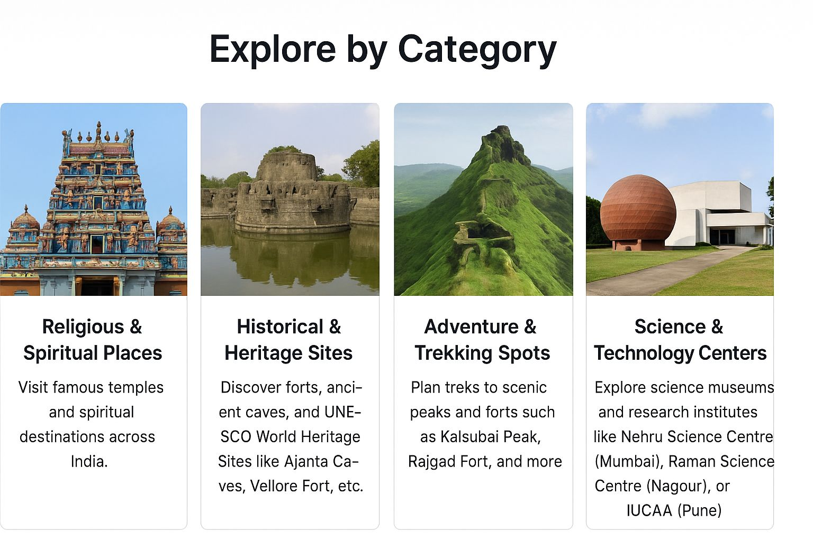

# PLAN & GO ✈️

</img>

<u>Welcome to Plan-n-Go and enjoy the trip</u>.We can take you around the entire Maharashtra.

---
<b>You can see that we can take you on a tour to different places in Maharashtra</b> like

1. Ajanta Caves
2. India Gate
3. Shaniwar Wada
4. Forest and Wildlife
5. Historical Place
6. Religious Destinations

---
Apart from its original aims and objectievs, the Association also undertakes to promote tourism within the Maharashtra.
The <b>Plan-n-Go</b> is purpose giving them the necessary travel information as a part of its program to attract tourists in Maharashtra.
<i>The <b>Plan-n-Go</b> also has reciprocal service arrangements with other Automobile Associations and clubs over the world.</i>

The Association is recognized as Maharashtra major authority on motoring issues and represents its members and motorists interests to the Goverment and other sector and industry group.

